<div align="center">

| <center> &#x1F344;&#x1F344;&#x1F344;&emsp;MUSHROOMER &emsp;&#x1F344;&#x1F344;&#x1F344; |
|---|
| &#x1F3DB;&#xFE0F;&emsp;**Universidad de Buenos Aires - Facultad de Ingeniería** |
| &#x1F4DA;&emsp;**86.65 - Sistemas Embebidos** |
| &#x1F464;&emsp;**Gabriel Sosa (87.311)** |
| &#x1F5D3;&emsp;**Primer cuatrimestre de 2025** |
<br><br>
</div>


<div align="center">

<h1 style="font-size:2.5em; margin-bottom:0.5em;">Memoria del Trabajo final</h1>

</div>

**Resumen**

&emsp;Este trabajo presenta el diseño e implementación de un sistema embebido (prototipo) para el control automatizado de las condiciones ambientales durante la fructificación de hongos comestibles. El sistema monitorea las variables clave, temperatura y humedad, y actúa en consecuencia mediante ventilación, calefacción, enfriamiento y humidificación, con el objetivo de mantener el ambiente dentro de los rangos óptimos para el desarrollo del cultivo. El dispositivo incluye una interfaz de usuario a través de un display y un teclado matricial, así como conectividad Bluetooth, lo que permite tanto el control local como remoto desde una aplicación para teléfonos móviles.

&emsp;La importancia de este trabajo radica en su aplicabilidad a la producción agroecológica de alimentos, particularmente en entornos domésticos o de pequeña escala, donde las soluciones comerciales suelen ser inaccesibles o inadecuadas. El desarrollo del sistema integra conocimientos fundamentales de la carrera, como el modelado mediante máquinas de estado finito, el uso de sensores y actuadores, la programación modular y la interacción con periféricos gráficos y de comunicación. A lo largo de esta memoria se detalla el proceso de diseño, las decisiones técnicas tomadas, la arquitectura del software y hardware, así como las pruebas realizadas para validar el funcionamiento del prototipo.

**Abstract**

&emsp;This work presents the design and implementation of an embedded system (prototype) for the automated control of environmental conditions during the fruiting stage of edible mushrooms. The system monitors key variables such as temperature and humidity, and responds accordingly through ventilation, heating, cooling, and humidification, aiming to maintain the environment within optimal ranges for crop development. The device features a user interface via a display and a matrix keypad, along with Bluetooth connectivity, enabling both local and remote control through an Android mobile application.

&emsp;The relevance of this work lies in its applicability to agroecological food production, particularly in domestic or small-scale environments where commercial solutions may be inaccessible or inadequate. The system’s development integrates core knowledge from the course, including finite state machine modeling, the use of sensors and actuators, modular programming, and interaction with graphical and communication peripherals. This report details the design process, technical decisions, software and hardware architecture, and the tests performed to validate the prototype’s functionality.

---

- [Índice de figuras](#índice-de-figuras)
- [Índice de tablas](#índice-de-tablas)
- [Registro de versiones](#registro-de-versiones)
- [Introducción general](#introducción-general)
  - [1.1 Presentación](#11-presentación)
  - [1.2 Importancia](#12-importancia)
  - [1.3 Análisis de producto comercial similar](#13-análisis-de-producto-comercial-similar)
  - [1.4 Diagrama de bloques del sistema](#14-diagrama-de-bloques-del-sistema)
- [Introducción específica](#introducción-específica)
  - [2.1 Requisitos del sistema](#21-requisitos-del-sistema)
  - [2.2 Casos de uso](#22-casos-de-uso)
    - [Caso de uso 1: Activación remota de la ventilación vía BLE](#caso-de-uso-1-activación-remota-de-la-ventilación-vía-ble)
    - [Caso de uso 2: Activación automática de la humidificación](#caso-de-uso-2-activación-automática-de-la-humidificación)
    - [Caso de uso 3: Consulta de variables ambientales actuales](#caso-de-uso-3-consulta-de-variables-ambientales-actuales)
  - [2.3 Descripción de módulos y tecnologías utilizadas](#23-descripción-de-módulos-y-tecnologías-utilizadas)
    - [2.3.1 Sensor de temperatura y humedad DHT22](#231-sensor-de-temperatura-y-humedad-dht22)
    - [2.3.2 Interfaz gráfica: Pantalla TFT ILI9341 + Teclado matricial](#232-interfaz-gráfica-pantalla-tft-ili9341--teclado-matricial)
    - [2.3.3 Interfaz Bluetooth BLE con módulo HM-10](#233-interfaz-bluetooth-ble-con-módulo-hm-10)
    - [2.3.4 Almacenamiento en tarjeta SD](#234-almacenamiento-en-tarjeta-sd)
    - [2.3.5 Actuadores](#235-actuadores)
    - [2.3.6 Dispositivos de alimentación](#236-dispositivos-de-alimentación)
- [Diseño e implementación](#diseño-e-implementación)
  - [3.1 Hardware del sistema](#31-hardware-del-sistema)
    - [3.1.1 Alimentación](#311-alimentación)
    - [3.1.2 Actuadores](#312-actuadores)
    - [3.1.3 Sensores](#313-sensores)
    - [3.1.4 Interfaces de usuario](#314-interfaces-de-usuario)
  - [3.2 Lógica de control mediante máquina de estados](#32-lógica-de-control-mediante-máquina-de-estados)
    - [3.2.1 Estados del sistema](#321-estados-del-sistema)
    - [3.2.2 Variables internas y umbrales de decisión](#322-variables-internas-y-umbrales-de-decisión)
    - [3.2.3 Diagrama de estados de la FSM](#323-diagrama-de-estados-de-la-fsm)
  - [3.3 Arquitectura modular del software](#33-arquitectura-modular-del-software)
    - [3.3.1 Organización general del código](#331-organización-general-del-código)
    - [3.3.2 Encapsulamiento y referencias](#332-encapsulamiento-y-referencias)
    - [3.3.3 Ventajas del diseño modular](#333-ventajas-del-diseño-modular)
  - [3.4 Interfaz de usuario](#34-interfaz-de-usuario)
    - [3.4.1 Interfaz local](#341-interfaz-local)
      - [Opciones del menú](#opciones-del-menú)
    - [3.4.2 Interfaz gráfica móvil (BLE)](#342-interfaz-gráfica-móvil-ble)
      - [Capturas de pantalla de la app móvil](#capturas-de-pantalla-de-la-app-móvil)
  - [3.5 Registro de eventos en tarjeta SD](#35-registro-de-eventos-en-tarjeta-sd)
    - [3.5.1 Formato del archivo de log](#351-formato-del-archivo-de-log)
    - [3.5.2 Generación automática y manual](#352-generación-automática-y-manual)
    - [3.5.3 Montaje y desmontaje de la tarjeta](#353-montaje-y-desmontaje-de-la-tarjeta)
    - [3.5.4 Implementación modular](#354-implementación-modular)
  - [3.6 Esquemáticos](#36-esquemáticos)
    - [3.6.1 Teclado matricial](#361-teclado-matricial)
    - [3.6.2 Display y módulo de tarjeta SD](#362-display-y-módulo-de-tarjeta-sd)
    - [3.6.3 Sensor de temperatura y humedad](#363-sensor-de-temperatura-y-humedad)
    - [3.6.4 Comunicación Bluetooth BLE](#364-comunicación-bluetooth-ble)
    - [3.6.5 Sistema de ventilación](#365-sistema-de-ventilación)
    - [3.6.6 Control del humidificador](#366-control-del-humidificador)
    - [3.6.7 Módulo Peltier](#367-módulo-peltier)
- [Ensayos y resultados](#ensayos-y-resultados)
    - [4.1 Pruebas funcionales del hardware](#41-pruebas-funcionales-del-hardware)
    - [4.2 Pruebas funcionales del firmware](#42-pruebas-funcionales-del-firmware)
    - [4.3 Pruebas de integración](#43-pruebas-de-integración)
- [Conclusiones](#conclusiones)
  - [5.1 Resultados obtenidos](#51-resultados-obtenidos)
  - [5.2 Próximos pasos](#52-próximos-pasos)
  - [Referencias](#referencias)
- [Anexos](#anexos)
  - [Anexo A: Mapa de pines del microcontrolador](#anexo-a-mapa-de-pines-del-microcontrolador)
  - [Anexo B: Diagrama esquemático completo del sistema](#anexo-b-diagrama-esquemático-completo-del-sistema)
  - [Anexo C: Código de bloques de la aplicación móvil](#anexo-c-código-de-bloques-de-la-aplicación-móvil)

# Índice de figuras

| Figura | Descripción | Sección |
|---|---|---|
| 1.4.1 | Diagrama en bloques del sistema *Mushroomer* | [1.4](#14-diagrama-en-bloques-del-sistema) |
| 2.3.1 | Módulo basado en sensor DHT22 | [2.3.1](#231-sensor-de-temperatura-y-humedad-DHT22) |
| 2.3.2.1 | Módulo display TFT 3.2" + touchscreen + lector SD | [2.3.2](#232-interfaz-gráfica-pantalla-tft-ili9341--teclado-matricial) |
| 2.3.2.2 | Teclado matricial 4x4 | [2.3.2](#232-interfaz-gráfica-pantalla-tft-ili9341--teclado-matricial) |
| 2.3.3 | Módulo Bluetooth Low Energy HM-10 | [2.3.3](#233-interfaz-bluetooth-ble-con-módulo-hm-10) |
| 2.3.5.1 | Celda Peltier Tec1-12706 y accesorios | [2.3.5](#235-actuadores) |
| 2.3.5.2 | Módulo BTS7960 (puente H) | [2.3.5](#235-actuadores) |
| 2.3.5.3 | Módulo servomotor SG90 | [2.3.5](#235-actuadores) |
| 2.3.6.1 | Fuente ATX de 400 W | [2.3.6](#236-dispositivos-de-alimentación) |
| 2.3.6.2 | Fuente step-down LM2596 | [2.3.6](#236-dispositivos-de-alimentación) |
| 3.2.2 | Diagrama de estados de la lógica de control | [3.2.2](#322-variables-internas-y-umbrales-de-decisión) |
| 3.4.1 | Menú principal del sistema en pantalla | [3.4.1](#341-interfaz-local) |
| 3.6.1 | Conexión del sensor DHT22 al microcontrolador | [3.6.1](#361-teclado-matricial) |
| 3.6.4 | Conexión del módulo BLE HM-10 | [3.6.4](#364-comunicación-bluetooth-ble) |
| 3.6.5 | Control del sistema de ventilación | [3.6.5](#365-sistema-de-ventilación) |
| 3.6.6 | Conducción del humidificador mediante transistor | [3.6.6](#366-control-del-humidificador) |
| 3.6.7 | Control del módulo Peltier mediante puente H BTS7960 | [3.6.7](#367-módulo-peltier) |
| 3.6.1 (app) | Pantalla de inicio de la aplicación móvil | [3.4.2](#342-interfaz-gráfica-móvil-ble) |
| 3.6.2 (app) | Listado de dispositivos Bluetooth disponibles | [3.4.2](#342-interfaz-gráfica-móvil-ble) |
| 3.6.3 (app) | Pantalla principal de la aplicación móvil | [3.4.2](#342-interfaz-gráfica-móvil-ble) |
| 3.6.4 (app) | Botón de ventilación forzada solicitado | [3.4.2](#342-interfaz-gráfica-móvil-ble) |
| 3.6.5 (app) | Ventilación forzada en curso (app) | [3.4.2](#342-interfaz-gráfica-móvil-ble) |
| 3.6.6 (app) | Configuración de umbral de humedad (app) | [3.4.2](#342-interfaz-gráfica-móvil-ble) |
| 3.6.7 (app) | Configuración de umbrales de temperatura (app) | [3.4.2](#342-interfaz-gráfica-móvil-ble) |

# Índice de tablas

| Tabla | Descripción | Sección |
|---|---|---|
| 2.2.1 | Caso de uso 1. Activación remota de la ventilación vía BLE | [2.2](#22-casos-de-uso) |
| 2.2.2 | Caso de uso 2. Activación automática de la humidificación | [2.2](#22-casos-de-uso) |
| 2.2.3 | Caso de uso 3. Consulta de variables ambientales actuales | [2.2](#22-casos-de-uso) |
| 3.1.1 | Distribución de líneas de alimentación en el sistema *Mushroomer* | [3.1.1](#311-alimentación) |
| 3.2.1 | Estados que componen la FSM | [3.2.1](#321-estados-del-sistema) |
| 3.3.1 | Descripción de los módulos de software implementados | [3.3.1](#331-organización-general-del-código) |
| 3.4.2.1 | Códigos de comandos que envía la aplicación móvil al sistema embebido | [3.4.2](#342-interfaz-gráfica-móvil-ble) |
| 3.6.2.2 | Formato de las respuestas enviadas por el sistema embebido a la aplicación móvil | [3.4.2](#342-interfaz-gráfica-móvil-ble) |


# Registro de versiones

| Revisión | Cambios realizados | Fecha |
|---|---|---|
| 1.0 | Redacción de la secciones: Resumen, Abstract y 1. Introducción. | 08/07/2025 |
| 1.1 | Redacción de la sección 2. Introducción específica. | 09/07/2025 |
| 1.2 | Redacción de la sección 3. Diseño e implementación. | 16/07/2025<br>20/07/2025<br>22/07/2025<br>30/07/2025 |
| 1.3 | Redacción de la sección 4. Ensayos y resultados. | 01/08/2025<br>02/08/2025 |
| 1.4 | Redacción de la sección 5. Conclusiones. | 03/08/2025 |


# Introducción general

## 1.1 Presentación

&emsp;El presente trabajo consiste en el diseño e implementación de un sistema embebido para el control automatizado de las condiciones ambientales en una cámara de fructificación de hongos comestibles. Dicho sistema, denominado *Mushroomer*, permite regular de forma automática  la humedad, la temperatura, la ventilación y la iluminación de la cámara, con el objetivo de mantener dichas variables dentro de rangos óptimos para el desarrollo del cultivo. Opcionalmente, los parámetros que determinan las acciones de regulación, pueden ser seleccionados por el usuario o la usuaria dentro de los rangos preetablecidos.

&emsp;Para ello, se integraron sensores y actuadores, junto con una interfaz de usuario compuesta por una pantalla gráfica y un teclado matricial. Además, se incorporó conectividad inalámbrica vía Bluetooth para permitir el monitoreo y control remoto desde una aplicación Android. El sistema fue desarrollado de forma modular, permitiendo su mantenimiento y expansión futura.

## 1.2 Importancia

&emsp;La relevancia de este trabajo radica en su aplicabilidad dentro de contextos de producción agroecológica y autocultivo, donde las soluciones comerciales suelen ser costosas o inadecuadas. *Mushroomer* ofrece una alternativa flexible y económica, accesible para entornos domésticos o de pequeña escala.

## 1.3 Análisis de producto comercial similar

&emsp;En el mercado argentino, el único producto comparable es la incubadora automática **INC101**, desarrollada por la empresa [Infomicelium](https://infomicelium.com.ar/productos/pack-oferta-incubadora-automatica-inc101/). Este dispositivo ofrece control automático de temperatura y humedad, ventilación temporizada e iluminación, siendo adecuado para el cultivo de hongos comestibles.

&emsp;El sistema *Mushroomer* presenta ventajas competitivas, entre ellas una interfaz gráfica con teclado matricial, registro digital de eventos, arquitectura modular y una aplicación Android vía Bluetooth Low Energy (BLE) que permite al usuario visualizar las lecturas actuales de las variables ambientales, configurar los umbrales de actuación sobre las mismas, consultar el estado actual del sistema y forzar la ventilación en forma remota. Esto lo convierte en una solución más completa, adaptable y orientada a la interacción moderna con el usuario.

| Característica | INC101 (Infomicelium) | Mushroomer |
|---|---|---|
| Control de humedad             | ✔ (temporizador + sensor)    | ✔ (digital, controlado por umbral) |
| Control de temperatura         | ✔ (controlador incluido)     | ✔ (sensor analógico)               |
| Iluminación programable        | ✔ (temporal)                 | ✔ (menú interactivo)               |
| Ventilación                    | ✔ (ventilador incluido)      | ✔ (cooler + compuerta con servomotor) |
| Interfaz gráfica               | ✖                            | ✔ (pantalla TFT + teclado matricial) |
| Registro de eventos            | ✖                            | ✔ (memoria SD opcional)            |
| Modularidad / expansión        | ✖                            | ✔ (diseño escalable)               |
| Precio aproximado              | > ARS 280.000                | No determinado                     |

&emsp;Como se observa en la comparación, *Mushroomer* incorpora características avanzadas como interfaz gráfica, arquitectura modular y posibilidad de ampliación, lo cual lo posiciona como una alternativa más robusta y adaptable.

## 1.4 Diagrama de bloques del sistema

&emsp;La **Figura 1.4.1** presenta un diagrama de bloques del sistema *Mushroomer*, que resume los principales módulos del prototipo y sus interconexiones. Cada bloque representa una funcionalidad clave del sistema y su relación con el microcontrolador STM32F429ZI.

<a name="figura-141"></a>
<center>
    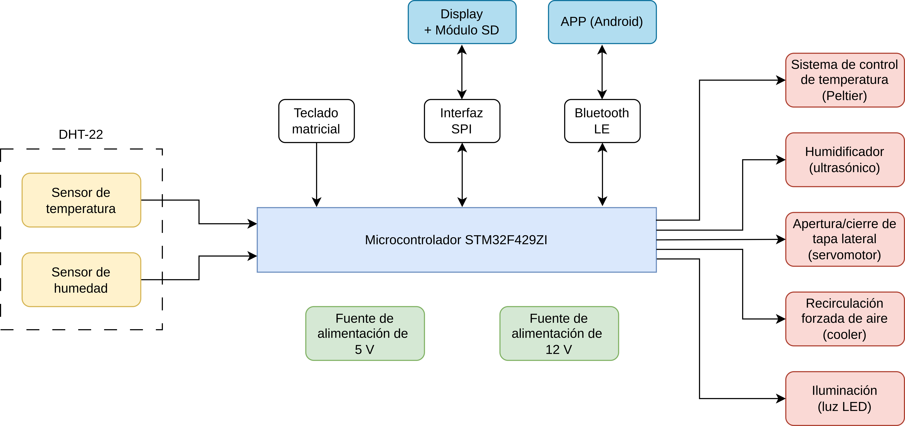
    
**Figura 1.4.1**: Diagrama de bloques del sistema *Mushroomer*.
</center>
</center>

---

# Introducción específica

## 2.1 Requisitos del sistema

&emsp;El sistema *Mushroomer* fue concebido para controlar de forma autónoma y configurable las condiciones ambientales de una cámara de fructificación de hongos. Para alcanzar este objetivo, se definieron los siguientes requisitos funcionales, agrupados por subsistemas. Todos ellos fueron redactados siguiendo criterios SMART (específicos, medibles, alcanzables, relevantes y acotados en el tiempo).

| Grupo | ID | Descripción |
|---|---|---|
| Sensor de humedad | 1.1 | El sistema debe medir la humedad relativa del aire cada 120 segundos automáticamente, cuando el usuario solicite una lectura por pantalla o cuando la aplicación móvil lo requiera. |
| Sensor de temperatura | 1.2 | El sistema debe medir la temperatura cada 120 segundos automáticamente, cuando el usuario solicite una lectura por pantalla o cuando la aplicación móvil lo requiera. |
| Humidificación | 2.1 | El sistema debe activar un humidificador mediante un relé. |
| Ventilación | 3.1 | El sistema debe encender un cooler y abrir una compuerta mediante un servomotor de forma sincronizada cada 5 minutos automáticamente o cuando el usuario solicite su activación por interfaz local o mediante la aplicación móvil. |
| | 3.2 | El conjunto cooler-compuerta debe estar montado correctamente en el recinto. |
| Control de temperatura | 4.1 | El sistema debe regular la temperatura dentro de los límites establecidos. |
| | 4.2 | El módulo Peltier para el control de temperatura debe estar montado correctamente en el recinto. |
| Interfaz gráfica | 5.1 | El sistema debe mostrar en pantalla las variables ambientales actuales (humedad y temperatura) y el estado del sistema. |
| | 5.2 | El sistema debe mostrar un menú con acciones disponibles. |
| Registro de eventos | 6.1 | El sistema debe registrar los eventos en memoria SD si está disponible. |
| Modo manual | 7.1 | El usuario podrá activar o desactivar la ventilación o la iluminación por medio de la interfaz local o mediante la aplicación móvil. |
| Seguridad | 8.1 | El sistema debe prevenir fallos por sensores desconectados. |
| Conectividad | 9.1 | El sistema debe tener la capacidad de informar las variables ambientales y ser controlado mediante interfaz Bluetooth a través de la aplicación móvil. |
| | 9.2 | El sistema debe permitir la configuración de los umbrales de actuación de humedad y temperatura desde la aplicación móvil. |

## 2.2 Casos de uso

&emsp;A continuación se describen tres casos de uso típicos, representando las principales interacciones entre el sistema y el usuario o la usuaria.

### Caso de uso 1: Activación remota de la ventilación vía BLE

| Elemento | Descripción |
|---|---|
| Disparador | El usuario desea forzar la ventilación desde la aplicación móvil. |
| Precondiciones | El sistema está encendido. La conexión BLE con la aplicación está activa. |
| Flujo principal | El usuario accede a la aplicación móvil y selecciona la opción “Force ventilation”. El sistema activa el cooler y abre la compuerta durante un tiempo predefinido. |
| Flujos alternativos | **a.** El sistema no recibe el comando por problemas de conectividad.<br>**b.** La compuerta no responde. |

<p align="center"><em>Tabla 2.2.1: Caso de uso 1. Activación remota de la ventilación vía BLE.</em></p>

---

### Caso de uso 2: Activación automática de la humidificación

| Elemento | Descripción |
|---|---|
| Disparador | El sistema detecta humedad inferior al umbral configurado. |
| Precondiciones | Sensor de humedad funcional. Humidificador conectado mediante un relé. |
| Flujo principal | El sistema activa el relé durante un tiempo predefinido. El evento es registrado en la tarjeta SD. |
| Flujos alternativos | **a.** La SD no está disponible: el evento se registra sólo en RAM.<br>**b.** El sensor no responde. <VER> |

<p align="center"><em>Tabla 2.2.2: Caso de uso 2. Activación automática de la humidificación.</em></p>

---

### Caso de uso 3: Consulta de variables ambientales actuales

| Elemento | Descripción |
|---|---|
 Disparador | El usuario desea visualizar la temperatura y la humedad actuales. |
| Precondiciones | Sistema encendido y sensores conectados. La pantalla o la app móvil deben estar operativas. |
| Flujo principal | El usuario accede a la opción de consulta en pantalla o en la aplicación móvil. El sistema muestra los valores actualizados cada 120 segundos. |
| Flujos alternativos| **a.** Algún sensor falla: se muestra un mensaje de error en pantalla o en la aplicación. |

<p align="center"><em>Tabla 2.2.3: Caso de uso 3. Consulta de variables ambientales actuales.</em></p>

## 2.3 Descripción de módulos y tecnologías utilizadas

&emsp;A fin de cumplir con los requisitos funcionales del sistema, se incorporaron diversos módulos de hardware y bibliotecas de software de terceros. A continuación, se describen los componentes principales utilizados en el desarrollo de *Mushroomer*.

### 2.3.1 Sensor de temperatura y humedad DHT22

<div align="center">
    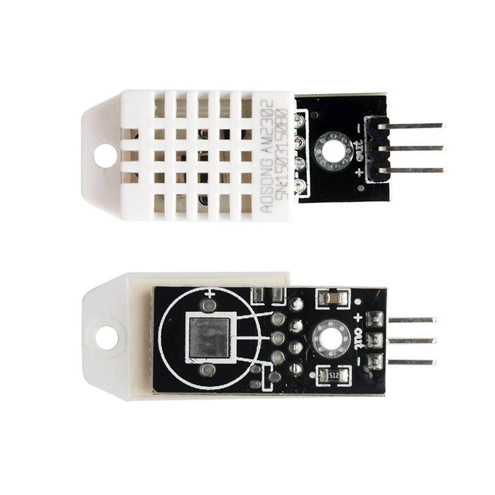
    
**Figura 2.3.1**: Módulo basado en sensor DHT22.
</div>


### 2.3.2 Interfaz gráfica: Pantalla TFT ILI9341 + Teclado matricial

&emsp;La interfaz principal del sistema se basa en una pantalla gráfica TFT de 3.2” con controlador ILI9341, comunicada con el microcontrolador mediante protocolo SPI. Esta pantalla permite visualizar información del sistema y acceder a un menú interactivo. Para la navegación por menú y carga de datos se utiliza un teclad
 matricial de 4×4 conectado por GPIOs, escaneado por software.

<div align="center">
    
    
**Figura 2.3.2.1**: Módulo display THT 3.2" + touchscreen XPT2046 + lector de tarjetas SD.
</div>

<div align="center">
    
    
**Figura 2.3.2.2**: Teclado matricial 4x4.
</div>

### 2.3.3 Interfaz Bluetooth BLE con módulo HM-10

<div align="center">
    
    
**Figura 2.3.3**: Módulo Bluetooth Low Energy HM-10.
</div>
    

### 2.3.4 Almacenamiento en tarjeta SD

&emsp;El sistema incluye un lector de tarjetas SD integrado en el módulo de pantalla (**Figura 2.3.2**), conectado mediante SPI. Se utiliza para registrar eventos relevantes (por ejemplo, activación de actuadores, cambios de estado), permitiendo la realización de análisis posteriores. El sistema de archivos utilizado es FAT32.

### 2.3.5 Actuadores

&emsp;El sistema cuenta con cuatro actuadores principales que regulan las condiciones internas de la cámara de fructificación: un humidificador ultrasónico, un ventilador centrífugo (cooler), una compuerta móvil y un módulo termoeléctrico Peltier.

<div align="center">
    
    
**Figura 2.3.5.1**: Celda peltier Tec1-12706 y accesorios.
</div>

<div align="center">
    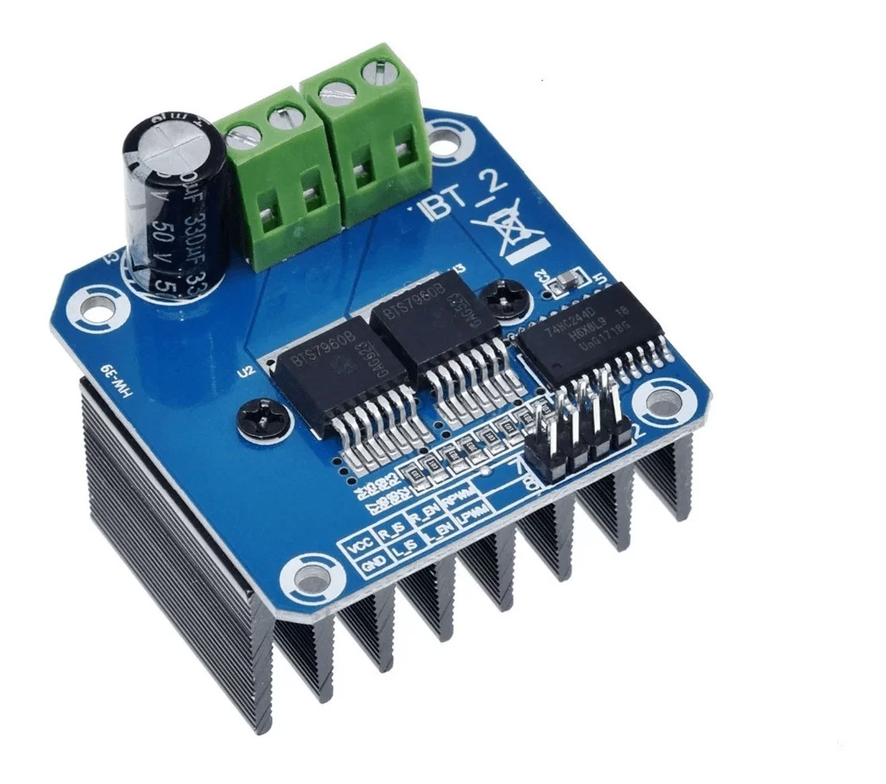
    
**Figura 2.3.5.2**: Módulo BTS7960 (puente H) [^7].
</div>

<div align="center">
    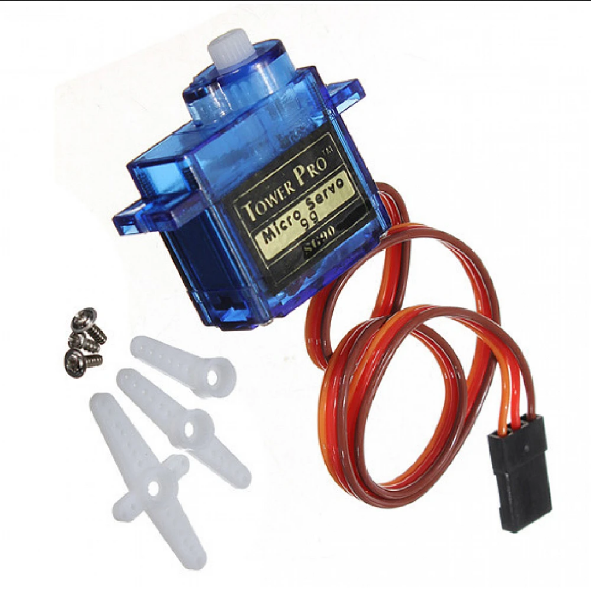
    
**Figura 2.3.5.3**: Módulo servomotor SG90.
</div>

### 2.3.6 Dispositivos de alimentación

<div align="center">
    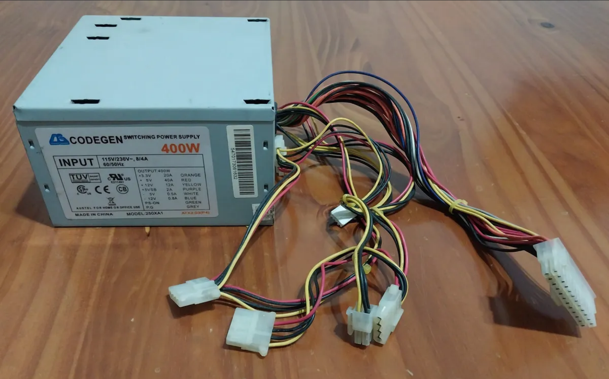
    
**Figura 2.3.6.1**: Fuente ATX de 400 W utilizada para alimentar los dispositivos de 12 V.
</div>

<div align="center">
    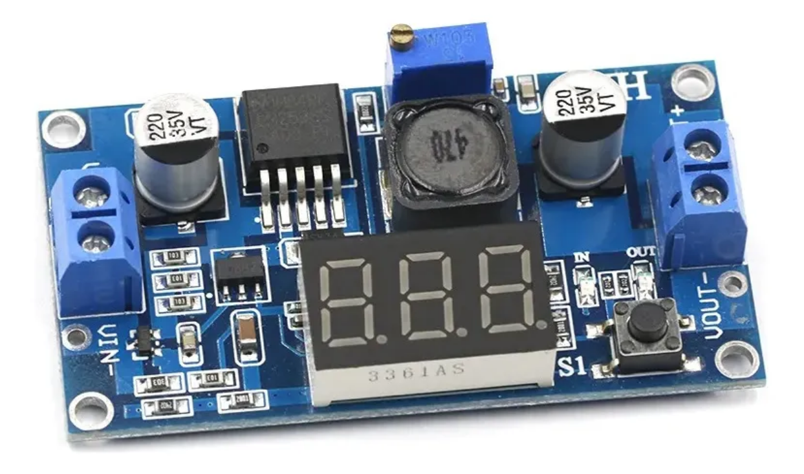
    
**Figura 2.3.6.2**: Fuente step-down LM2596 utilizada para alimentar los dispositivos de 5 V.
</div>

# Diseño e implementación

## 3.1 Hardware del sistema

&emsp;El diseño del hardware para el prototipo del sistema *Mushroomer* se centra en la integración eficiente de sensores, actuadores e interfaces. Para ello, se optó por una arquitectura modular, facilitando tanto el desarrollo incremental como el diagnóstico de fallos.

&emsp;La elección de los componentes respondió a criterios de disponibilidad, compatibilidad, simplicidad de comunicación y robustez. Todos los periféricos fueron conectados a un microcontrolador STM32F429ZI [^2], montado sobre una placa de desarrollo NUCLEO-F429ZI [^3], que ofrece recursos suficientes para el manejo simultáneo de múltiples buses (GPIO, SPI, UART, PWM).

&emsp;Para llevar a cabo la integración del hardware se utilizaron protoboards y cables con conectores de tipo Dupont, diferenciados por color y etiquetas para una mejor organización.

### 3.1.1 Alimentación

&emsp;El sistema *Mushroomer* emplea dos líneas principales de alimentación: una de 12 V, suministrada por una fuente ATX de PC, y otra de 5 V, generada mediante una fuente step-down LM2596 conectada a una fuente externa de 12 V / 3 A. Esta configuración permite distribuir la carga de forma eficiente y evitar sobrecargas.

| Línea de alimentación | Fuente | Tensión | Dispositivos conectados |
|---|---|---|---|
| 12 V | Fuente ATX | 12 V | Módulo Peltier, ventiladores del disipador, ventilador externo |
| 5 V | LM2596 + 12 V / 3 A | 5 V | Servomotor, relé del ventilador, humidificador, display, HM-10 |

<p align="center"><em>Tabla 3.1.1: Distribución de líneas de alimentación en el sistema *Mushroomer*.</em></p>

### 3.1.2 Actuadores

&emsp;En cuanto a los actuadores, se utilizó un humidificador ultrasónico alimentado a 5 V y controlado mediante un transistor NPN BC548; un sistema de ventilación compuesto por un ventilador y una compuerta móvil controlada por un servomotor SG90; y un módulo Peltier para calefacción/enfriamiento, cuya celda es Tec1-12706.

### 3.1.3 Sensores

&emsp;Los sensores de temperatura y humedad (DHT22) fueron conectados a un pin GPIO. Este sensor permite monitorear periódicamente las variables ambientales. Para la interfaz con el sensor se utilizó la librería DHT de Moises Marangoni [^15], que facilita la comunicación con sensores de la familia DHT a través de un protocolo de comunicación de un solo cable.

### 3.1.4 Interfaces de usuario

&emsp;La interfaz con el usuario incluye una pantalla TFT SPI de 3.2" con controlador ILI9341 y un teclado matricial 4×4 conectado por GPIO. Para el almacenamiento de eventos, se utilizó una tarjeta SD integrada en el mismo módulo de pantalla, conectada también por SPI. Además, se incorporó un módulo Bluetooth BLE (HM-10) para permitir el monitoreo y control remoto desde una aplicación Android.

## 3.2 Lógica de control mediante máquina de estados

&emsp;El sistema *Mushroomer* implementa una lógica de control basada en una máquina de estados finitos (FSM, por sus siglas en inglés), diseñada específicamente para regular las condiciones ambientales necesarias para la fructificación de hongos. Dicha FSM centraliza las decisiones de control mediante la lectura de humedad y temperatura provista por el sensor DHT22 y el accionamiento coordinado de los actuadores.

### 3.2.1 Estados del sistema

&emsp;La FSM se encuentra modelada en la clase `FSMController`, cuyo estado interno está representado mediante el tipo de dato enumerado `MushroomerState_t`, definida en el archivo `state_defs.h`. Los estados posibles son:

| Estado | Descripción |
|---|---|
| `IDLE` | Estado inicial y de espera tras cada transición. Se determinan las condiciones para transicionar al resto de los estados. |
| `VENTILATING` | Activa el ventilador y abre la compuerta para renovar el aire del sistema. |
| `COOLING` | Enfría mediante la celda Peltier en modo de enfriamiento. |
| `HEATING` | Calienta mediante la celda Peltier en modo de calentamiento. |
| `HUMIDIFYING` | Activa el humidificador para elevar el nivel de humedad relativa. |

<p align="center"><em>Tabla 3.2.1: Estados que componen la FSM.</em></p>

&emsp;Cada transición se determina de forma autónoma por la FSM a partir de las condiciones ambientales leídas por el sensor DHT22.

### 3.2.2 Variables internas y umbrales de decisión

&emsp;La FSM mantiene internamente:

* Temperatura y humedad más recientes (`_lastTemp`, `_lastHumidity`)

* Tiempos de última transición y de bloqueo mínimo entre ciclos de cada actuador (`_coolerLastUseTime`, etc.)

* Umbrales configurables de temperatura superior/inferior y humedad mínima (`_tempUpperThreshold`, `_tempLowerThreshold`, `_humLowerThreshold`)

* Bandera `forceVentilation`, activada por teclado o remotamente por Bluetooth.

&emsp;Los umbrales iniciales provienen de constantes predefinidas y pueden ajustarse dinámicamente durante la ejecución.

### 3.2.3 Diagrama de estados de la FSM

<center>
    
    
**Figura 3.2.2**: Diagrama de estados de la lógica de control.
Se ilustran las transiciones desde el estado `IDLE` hacia los demás con flechas y códigos en color rojo, y en verde en sentido contrario. Cada bloque de código comienza con las condiciones de transición hacia el siguiente estado y luego del caracter `/` (barra) se indican las acciones realizadas antes de la transición.
</center>

## 3.3 Arquitectura modular del software

&emsp;El software del sistema *Mushroomer* fue desarrollado siguiendo una arquitectura modular, orientada a objetos, con el objetivo de lograr una implementación clara, mantenible y extensible. Cada componente del sistema —sensores, actuadores, controladores y periféricos— se encapsula en módulos independientes que interactúan a través de interfaces bien definidas. Esta estrategia permite desacoplar la lógica de control del hardware subyacente, facilitando tanto el desarrollo como futuras modificaciones.

### 3.3.1 Organización general del código

&emsp;La estructura del código se organiza en subdirectorios dentro de la carpeta `modules/`, cada uno correspondiente a una funcionalidad específica del sistema:

| Carpeta | Contenido |
|---|---|
| `modules/fsm/` | Lógica de control central mediante máquina de estados finitos (`FSMController`) |
| `modules/sensors/` | Interface para el sensor DHT22 de temperatura y humedad |
| `modules/actuators/` | Controladores de actuadores físicos: celda Peltier, humidificador, ventilador, compuerta |
| `modules/display/` | Control gráfico del display TFT (basado en ILI9341) y rutinas de visualización |
| `modules/keypad/` | Escaneo e interpretación del teclado matricial |
| `modules/menu/` | Interfaz de usuario: menú, navegación y visualización |
| `modules/ble/` | Comunicación Bluetooth BLE con la aplicación móvil |
| `modules/sdcard/` | Gestión de almacenamiento en tarjeta SD (lectura/escritura de logs) |
| `modules/events/` | Registro de eventos relevantes en tiempo de ejecución |
| `moduels/config/` | Asignación de pines y parámetros de configuración |

<p align="center"><em>Tabla 3.3.1: Descripción de los módulos de software implementados.</em></p>

&emsp;El archivo `main.cpp` inicializa todos los módulos del sistema, instancia la clase `FSMController` y lanza múltiples hilos (threads) en paralelo utilizando el sistema operativo en tiempo real (RTOS) provisto por Mbed OS [^11]. Cada hilo se encarga de una funcionalidad específica: actualización del controlador de estados (`fsmThread`), procesamiento de la interfaz Bluetooth (`bleThread`), lectura del teclado (`keypadThread`) y registro automático de eventos (`loggerThread`). El hilo principal (`main`) permanece en reposo, permitiendo que las tareas periódicas se ejecuten de manera concurrente. Este enfoque mejora la eficiencia del sistema y evita bloqueos debidos a operaciones secuenciales prolongadas.

### 3.3.2 Encapsulamiento y referencias

&emsp;Siguiendo los principios de bajo acoplamiento y alta cohesión, cada clase del sistema recibe sus dependencias mediante referencias explícitas en sus constructores. Por ejemplo, el controlador principal `FSMController` recibe objetos de tipo `DHT22Sensor`, `PeltierController`, `Fan`, `Humidifier` y `Flap`. Esto permite aislar responsabilidades.

&emsp;La inicialización del controlador de estados se realiza en el archivo principal `main.cpp`, donde se instancian las clases concretas y se invoca el método `begin()` para su configuración inicial.

&emsp;Además, el sistema define una interfaz común para todos los actuadores, mediante una clase abstracta `Actuator`, ubicada en `modules/actuators/Actuator.h`. Esta clase declara cuatro métodos puros que deben ser implementados por cada actuador concreto:

```cpp
class Actuator {
public:
    virtual void begin() = 0;
    virtual void on() = 0;
    virtual void off() = 0;
    virtual bool isOn() = 0;
    virtual ~Actuator() = default;
};
```

&emsp;De esta manera, todos los actuadores del sistema (como `Fan`, `Flap`, `Humidifier`, `Lights` y `PeltierController`) comparten una interfaz uniforme, lo cual permite intercambiarlos fácilmente, abstraer su uso en la lógica de control y mejorar la escalabilidad del sistema.

&emsp;Este enfoque promueve el encapsulamiento, ya que cada clase expone únicamente los métodos públicos necesarios (`begin()`, `on()`, `off()`, `isOn()`), ocultando la lógica interna de implementación y minimizando las dependencias externas.

### 3.3.3 Ventajas del diseño modular

&emsp;El diseño modular adoptado en *Mushroomer* presenta las siguientes ventajas:

- **Mantenibilidad**: los cambios en un módulo (por ejemplo, refactorización de código en el sensor DHT22) no afectan el resto del sistema.
- **Reutilización**: los módulos pueden ser fácilmente reutilizados en otros proyectos similares.
- **Extensibilidad**: se pueden agregar nuevas funcionalidades (como más actuadores o nuevos modos de operación) sin reescribir el núcleo del sistema.
- **Claridad**: la estructura del código facilita su comprensión, tanto para el desarrollador como para terceros.

## 3.4 Interfaz de usuario

&emsp;El sistema *Mushroomer* ofrece una interfaz de usuario compuesta por una pantalla gráfica TFT de 3.2” y un teclado matricial físico 4×4. Además, incorpora una interfaz remota basada en comunicación Bluetooth Low Energy (BLE), accesible desde una aplicación móvil Android desarrollada en MIT App Inventor. Ambas interfaces permiten interactuar con el sistema, visualizar variables ambientales y ejecutar comandos específicos.

### 3.4.1 Interfaz local

&emsp;La librería utilizada para el manejo del display es una adaptación de Zoltán Hudák para Mbed OS [^13], que expone funciones de bajo nivel como `tft_text()` para imprimir texto en pantalla, y `tft_clear()` para limpiar el contenido. Estas funciones permiten renderizar el menú de manera eficiente, sin necesidad de bibliotecas gráficas pesadas.

&emsp;El menú es estático y se compone de once entradas numeradas, más un reloj en tiempo real (RTC) ubicado en la esquina inferior derecha. La opción relacionada con la tarjeta SD (`D`) se actualiza dinámicamente para reflejar el estado de montaje actual. Los textos y posiciones son definidos en el archivo `menu_layout.h` y renderizados desde el método `Menu::show()`.

<div align="center">

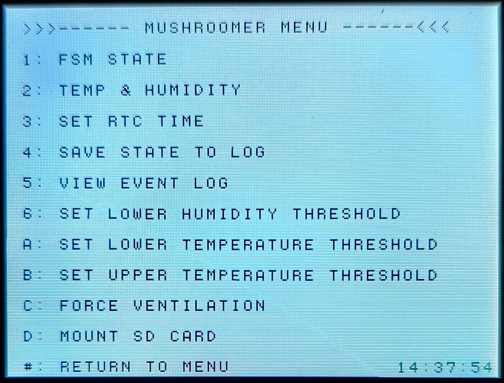<br>
**Figura 3.4.1**: Menú principal del sistema en pantalla. La última línea muestra el reloj en formato HH:MM:SS.

</div>

#### Opciones del menú

| Opción | Descripción |
|---|---|
| `1` | Mostrar el estado actual de la FSM (estado y tiempo en ese estado) |
| `2` | Visualizar las variables ambientales actuales (temperatura y humedad) |
| `3` | Configurar la hora y fecha del RTC mediante teclado matricial |
| `4` | Guardar el estado actual del sistema en la tarjeta SD |
| `5` | Mostrar el registro de eventos (`mushroomer_log.csv`) línea por línea |
| `6` | Ingresar nuevo umbral inferior de humedad desde el teclado |
| `A` | Ingresar nuevo umbral inferior de temperatura |
| `B` | Ingresar nuevo umbral superior de temperatura |
| `C` | Ejecutar ventilación forzada inmediata |
| `D` | Montar o desmontar la tarjeta SD según el estado actual |
| `#` | Regresar al menú desde una opción activa |

&emsp;La interacción con el menú se realiza mediante el teclado matricial físico, que permite seleccionar opciones utilizando teclas alfanuméricas. Internamente, la función `Menu::update()` interpreta la tecla presionada y ejecuta la acción correspondiente, utilizando métodos privados de la clase `Menu`.

### 3.4.2 Interfaz gráfica móvil (BLE)

&emsp;El sistema incluye una aplicación móvil desarrollada en MIT App Inventor que se comunica con el microcontrolador mediante el módulo HM-10 [^6] usando Bluetooth Low Energy (BLE). Esta aplicación permite al usuario consultar variables ambientales, forzar ventilación, encender/apagar la iluminación, y configurar umbrales de temperatura y humedad en tiempo real.

&emsp;La comunicación entre la app y el sistema embebido sigue un protocolo textual simple basado en comandos del tipo:

```
#<código> <valor>
```

&emsp;El valor numérico es obligatorio en todos los casos, incluso para comandos que no lo requieren funcionalmente. En dichos casos, se utiliza el valor `0.0` como marcador neutro. El microcontrolador analiza estos comandos y ejecuta acciones específicas según su identificador. A continuación se resume el significado de cada código implementado:

| Código | Función| Valor enviado|
|---|---|---|
| `1` | Consultar estado de la FSM | `0.0` |
| `2` | Consultar temperatura y humedad | `0.0` |
| `3` | Consultar umbrales actuales | `0.0` |
| `4` | Solicitar ventilación forzada | `0.0` |
| `5` | Encender o apagar luces | `0.0` |
| `6` | Establecer umbral inferior de humedad | Valor en % (float) |
| `7` | Establecer umbral inferior de temperatura | Valor en °C (float) |
| `8` | Establecer umbral superior de temperatura | Valor en °C (float) |

<p align="center"><em>Tabla 3.4.2.1: Códigos de comandos que envía la aplicación móvil al sistema embebido.</em></p>


&emsp;Las respuestas del sistema se devuelven también como cadenas de texto estructuradas.

| Respuesta | Significado |
|---|---|
| `STATE <estado>` | Estado actual de la máquina de estados (por ejemplo: `IDLE`, `HEATING`, etc.) |
| `READ <temp> <hum>` | Valores actuales de temperatura y humedad, separados por espacio (°C y %) |
| `RTH <hum_thr> <temp_min> <temp_max>` | Umbral de humedad y umbrales inferior y superior de temperatura |
| `CMD_FORCE_VENT_OK` | Confirmación de ventilación forzada exitosa |
| `CMD_SWITCH_LIGHTS_OK` | Confirmación de cambio de estado en la luz |
| `CMD_LOWER_HUM_OK` | Confirmación de nuevo umbral de humedad aplicado |
| `CMD_LOWER_TEMP_OK` | Confirmación de nuevo umbral inferior de temperatura aplicado |
| `CMD_UPPER_TEMP_OK` | Confirmación de nuevo umbral superior de temperatura aplicado |

<p align="center"><em>Tabla 3.4.2.1: Formato de las respuestas enviadas por el sistema embebido a la aplicación móvil.</em></p>

#### Capturas de pantalla de la app móvil

<div align="center">

<br>
**Figura 3.6.1**: Pantalla de inicio de la aplicación móvil. Muestra un reloj y un botón de conexión.

<br>

<br>
**Figura 3.6.2**: Listado de dispositivos Bluetooth disponibles. Muestra una lista de dispositivos cercanos. En este caso, el módulo HM-10 aparece con el nombre por defecto *"BT05"*.

<br>

<br>
**Figura 3.6.3**: Pantalla principal de la aplicación móvil. Muestra el estado actual del sistema y permite ejecutar los comandos de ventilación forzada y encender/apagar luz. Los botones de humedad y temperatura exhiben la lectura actual y ofrecen acceso a los menús de configuración de umbrales. El botón de conexión muestra *"Connected to BT05"* (nombre por defecto del módulo BLE HM-10), que confirma la conexión activa.

<br>

<br>
**Figura 3.6.4**: El botón de ventilación forzada muestra el texto *"Requested"* inmediatamente después de ser presionado. En ese instante, el comando `4` (descrito en la **Tabla 3.4.2.1**) es enviado al microcontrolador.

<br>

<br>
**Figura 3.6.5**: Ventilación forzada en curso. El botón correspondiente cambia dinámicamente su texto a *"In progress"*, indicando que la acción fue reconocida por el sistema.

<br>

<br>
**Figura 3.6.6**: Pantalla de configuración del umbral inferior de humedad. Se ingresa a este menú al presionar el botón superior derecho en la pantalla principal (el que muestra la humedad actual). El valor del umbral seleccionado con el slider es almacenado localmente y se envía al volver a la pantalla principal.

<br>

<br>
**Figura 3.6.7**: Configuración de los umbrales inferior y superior de temperatura. Se accede desde el botón que muestra la temperatura actual. Los valores elegidos no se envían de inmediato, sino que se consolidan al regresar a la pantalla principal.

</div>

## 3.5 Registro de eventos en tarjeta SD

&emsp;Se implementó un mecanismo de registro persistente de eventos en una tarjeta microSD, con el objetivo de documentar el comportamiento del sistema a lo largo del tiempo. Esta funcionalidad permite auditar el funcionamiento, detectar anomalías y generar estadísticas útiles para los usuarios.

&emsp;El archivo de registro se denomina `mushroomer_log.csv` y se almacena en el directorio raíz de la tarjeta SD. La escritura de eventos se realiza en modo *append*, agregando nuevas líneas sin borrar las existentes. La tarjeta debe estar montada para que el registro funcione correctamente.

### 3.5.1 Formato del archivo de log

&emsp;Cada entrada del archivo sigue el siguiente formato:

```
timestamp,state,temperature,humidity
```
* **timestamp**: marca de tiempo con formato `YYYY:MM:DD HH:MM:SS`.
* **state**: estado actual de la máquina de estados finita (`IDLE`, `VENTILATING`, etc.).
* **temperature** y **humidity**: lecturas capturadas por el sensor DHT22 en el momento del registro.

&emsp;El archivo incluye una línea inicial con el encabezado. Las entradas se agregan secuencialmente en cada evento relevante.

### 3.5.2 Generación automática y manual

&emsp;El archivo `main.cpp` contiene lógica que genera registros automáticamente durante la ejecución del sistema. Además, el usuario puede forzar la creación de una entrada mediante la opción `"4: Save State to Log"` disponible en el menú principal.

&emsp;Esta entrada es útil para capturar eventos puntuales o verificar el funcionamiento del sistema en un momento específico.

### 3.5.3 Montaje y desmontaje de la tarjeta

&emsp;La tarjeta microSD se monta y desmonta dinámicamente a través de las opciones del menú, que alternan entre:

- `"D: Mount SD card"` — cuando la tarjeta no está montada.
- `"D: Unmount SD card"` — cuando ya está montada.

&emsp;Esto permite remover la tarjeta de forma segura sin apagar el sistema.

### 3.5.4 Implementación modular

&emsp;El acceso a la tarjeta está encapsulado en la clase `SDManager`, ubicada en el módulo `sdcard/`. Esta clase utiliza las interfaces `SDBlockDevice` y `FATFileSystem` provistas por Mbed OS para montar y desmontar el sistema de archivos FAT.

&emsp;El registro de eventos está gestionado por la clase `EventLogger`, ubicada en el módulo `events/`. Esta clase construye cada línea de log en base a los datos del sistema y llama al método `addEntry()` para escribirla en el archivo `mushroomer_log.csv`. Este método se encarga de:

- Comprobar si la tarjeta está montada (`SDManager::isMounted()`),
- Crear el archivo si no existe,
- Agregar la nueva línea en modo *append*.

&emsp;De este modo, el registro se realiza de forma segura, modular y persistente.

## 3.6 Esquemáticos

&emsp;En esta sección se presentan los esquemas eléctricos de cada uno de los módulos del sistema *Mushroomer*. Todos estos fueron confeccionados en KiCad [^14]. 

&emsp;Para mejorar la claridad de los esquemáticos y facilitar su lectura, se tomaron algunas decisiones específicas:

- Las etiquetas de los pines de la placa NUCLEO-F429ZI se indicaron en algunos casos con su nombre lógico (por ejemplo, `PD15` o `PE13`) en lugar de utilizar exclusivamente las numeraciones físicas del conector. Esto se debe a que ciertos pines se encuentran en el lado opuesto del conector, por lo que el uso del nombre del pin permite seguir mejor el conexionado.
- Cada cable de conexión se etiquetó con el nombre corerspondiente a la definición hecha en el archivo `modules/config/pins.h`, lo que permite identificar fácilmente la función de cada línea.
- Las líneas de alimentación  `+12V` y `+5V` provienen de fuentes estables externas. La primera es suministrada por una fuente conmutada ATX, mientras que la segunda se obtiene mediante una fuente step-down basada en el integrado LM2596 y alimentada por una fuente de 12V/3A.

### 3.6.1 Teclado matricial

<div align="center">

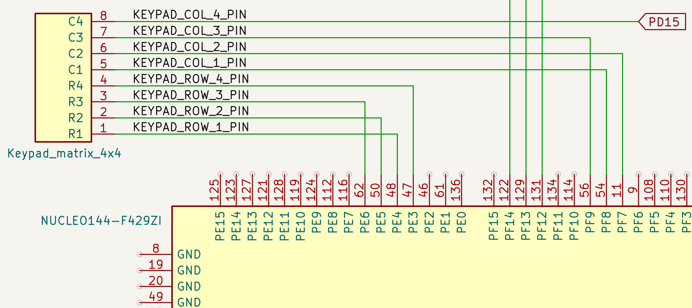<br>
**Figura 3.6.1**: Teclado. El esquema muestra la conexión de un teclado matricial de 4×4 a la placa NUCLEO-F429ZI. Cada línea de fila (R1–R4) y de columna (C1–C4) está conectada a pines GPIO individuales de los puertos D, E y F  del microcontrolador. El escaneo del teclado se realiza mediante la activación secuencial de las filas y la lectura de las columnas. La gestión de los pull-ups internos y el antirrebote se implementa por software. Esta configuración permite detectar las 16 teclas posibles utilizando solo ocho pines digitales.

</div>

### 3.6.2 Display y módulo de tarjeta SD

<div align="center">

<br>
**Figura 3.6.2**: Interfaz SPI del módulo combinado de display ILI9341 y lector de tarjeta SD. Se utiliza una pantalla TFT de 320×240 píxeles. Ambos dispositivos se conectan al microcontrolador mediante líneas SPI distintas. También se incluyen señales adicionales como D/C, RESET y LED para el control total del display.

</div>

### 3.6.3 Sensor de temperatura y humedad

<div align="center">

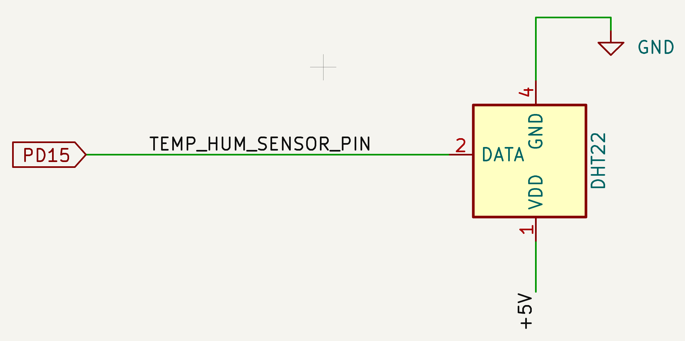<br>
**Figura 3.6.3**: Conexión del sensor DHT22 al microcontrolador. Este sensor digital de temperatura y humedad se alimenta con 5V y su línea de datos se conecta al pin PD15 del microcontrolador. Permite obtener lecturas periódicas con una resolución aceptable y un bajo consumo energético.

</div>

### 3.6.4 Comunicación Bluetooth BLE

<div align="center">

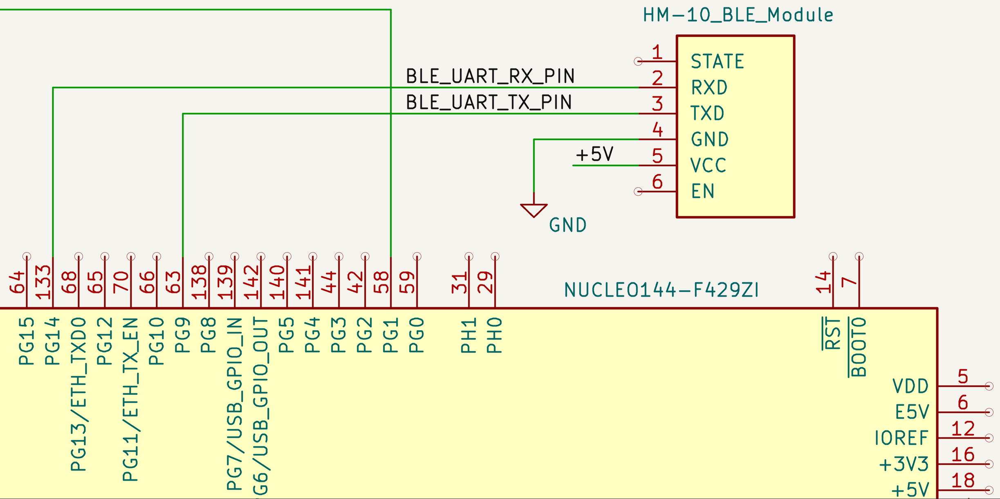<br>
**Figura 3.6.4**: Conexión del módulo BLE HM-10. Este módulo permite la comunicación inalámbrica con la aplicación móvil mediante Bluetooth Low Energy. Se conecta al microcontrolador utilizando una interfaz UART convencional (TXD y RXD), alimentado con 5V.

</div>

### 3.6.5 Sistema de ventilación

<div align="center">

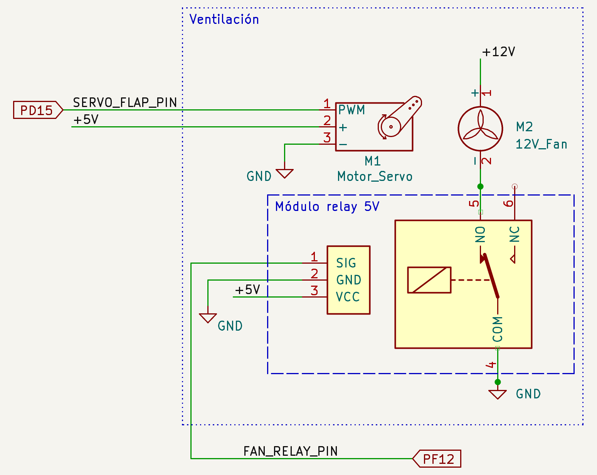<br>
**Figura 3.6.5**: Control del sistema de ventilación. El esquema muestra un servomotor que acciona una compuerta de ventilación, y un cooler de 12V controlado mediante un relé de 5V. El servomotor es controlado por señal PWM desde el pin PD15, mientras que el relé es activado por señal lógica del pin PF12. El módulo de relé está optoacoplado para aislar el microcontrolador del circuito de potencia.

</div>

### 3.6.6 Control del humidificador

<div align="center">

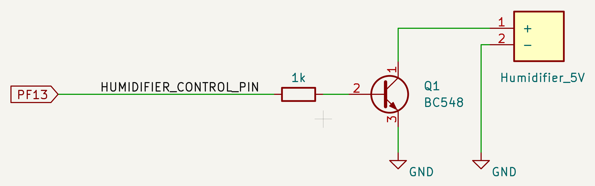<br>
**Figura 3.6.6**: Conducción del humidificador mediante transistor. El humidificador ultrasónico funciona a 5V y es controlado mediante un transistor TBJ NPN BC548. La base del transistor se conecta al  pin PE13 del microcontrolador a través de una resistencia de 1 kΩ.

</div>

### 3.6.7 Módulo Peltier

<div align="center">

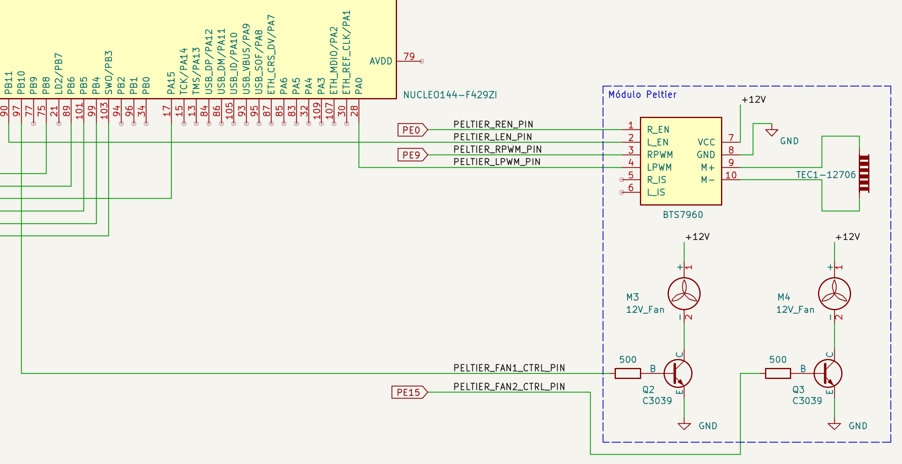<br>
**Figura 3.6.7**: Control del módulo Peltier mediante puente H BTS7960. El esquema muestra la conexión de un módulo de refrigeración basado en una celda Peltier (TEC1-12706), controlada por el puente H BTS7960. Se utilizan señales PWM diferenciadas para los canales izquierdo (LPWM) y derecho (RPWM), además de señales de habilitación (REN, LEN). Dos coolers de 12 V asociados al disipador de la celda se activan mediante transistores C3039 controlados por las salidas PE15 del microcontrolador. El sistema permite invertir la dirección de disipación térmica, habilitando tanto el calentamiento como el enfriamiento. Las dos caras de la celda se conectan a conjuntos disipador-cooler.

</div>

# Ensayos y resultados

### 4.1 Pruebas funcionales del hardware

&emsp;Para validar el funcionamiento del hardware del sistema *Mushroomer*, se realizaron pruebas individuales sobre cada uno de los módulos físicos integrados:

- **Sensor DHT22**: Se comprobó la correcta lectura de temperatura y humedad relativa conectando el sensor al pin digital PD15 de la placa NUCLEO-F429ZI. Las mediciones mostraron una respuesta estable y coherente, tanto en reposo como ante cambios ambientales simulados (por ejemplo, al acercar una fuente de calor o vapor).

- **Módulo de ventilación**: El ventilador de 12 V fue conectado mediante un módulo relé, que se activó correctamente desde la salida digital PF12. Se verificó el accionamiento y la respuesta del servomotor asociado a la compuerta, controlado por PWM desde PD15.

- **Humidificador ultrasónico**: El módulo fue alimentado con 5 V y controlado por un transistor NPN (BC548) controlado por el pin PE13. Su encendido y apagado fue verificado configurando umbrales inferiores de humedad convenientemente mediante el teclado y la app móvil.

- **Display TFT y lector SD**: Ambos módulos SPI fueron conectados y testeados de forma independiente. El display ILI9341 mostró gráficos y texto correctamente, incluyendo el reloj en tiempo real, mientras que el lector SD permitió crear y actualizar archivos de log en formato CSV.

- **Módulo Peltier + H-bridge BTS7960**: Se validó el encendido, cambio de dirección y control PWM de la celda Peltier utilizando señales separadas de activación y modulación. Los ventiladores de 12 V correspondientes a los disipadores funcionaron correctamente mediante el uso de transistores tipo C3039.

- **Teclado matricial 4×4**: Se testeó el escaneo correcto del teclado mediante la FSM del menú, verificando que cada tecla se detecta con precisión sin rebotes indeseados.

- **Módulo BLE HM-10**: Se verificó la comunicación UART desde la NUCLEO a la app móvil. El módulo respondió de forma inmediata a comandos de lectura, cambio de estado y escritura de umbrales.

### 4.2 Pruebas funcionales del firmware

&emsp;Las pruebas del firmware se centraron en verificar el comportamiento esperado del sistema frente a diferentes condiciones ambientales y entradas del usuario. El núcleo del software está basado en una máquina de estados finitos (FSM) que decide cuándo activar cada actuador.

- **Lógica de transición de estados**: Se comprobó que la FSM reacciona correctamente a los cambios de temperatura y humedad, ingresando en los estados `COOLING`, `HEATING`, `VENTILATING` o `HUMIDIFYING` según los umbrales definidos. Cada transición fue acompañada por la activación del actuador correspondiente.

- **Umbrales configurables**: Se validó que los umbrales de temperatura y humedad puedan ser modificados tanto desde el teclado como desde la aplicación móvil, y que el sistema actúe en consecuencia luego de recibir los nuevos valores.

- **Interacción con el menú local**: Se probaron todas las opciones del menú del sistema. La navegación por teclas y la actualización de la interfaz gráfica en el display funcionaron correctamente. El sistema también respondió apropiadamente a las órdenes de encendido manual de luces y guardado de eventos en la tarjeta SD.

- **Comandos BLE**: Se probó el envío de comandos desde la app móvil usando códigos numéricos (por ejemplo, `1` para consultar el estado o `4` para forzar ventilación). El sistema respondió correctamente a cada comando y devolvió respuestas estructuradas.

- **Persistencia y respuesta de la interfaz**: Se verificó que el sistema mantiene su estado interno de forma coherente y que no se producen comportamientos indeseados ante cambios rápidos de condiciones. El reloj en pantalla y las respuestas por consola fueron consistentes.

&emsp;Estas pruebas permitieron validar que el firmware es estable, robusto y responde en tiempo real a las condiciones del entorno, integrando todos los módulos de hardware de manera coherente.

### 4.3 Pruebas de integración

&emsp;Se realizaron pruebas de integración para validar el comportamiento del sistema en condiciones de operación reales. Se utilizó un recinto rudimentario para el ensayo (caja de cartón).

&emsp;La interacción entre todos los módulos fue exitosa: el sistema respondió con cambios de estado apropiados, activó o desactivó los actuadores según los umbrales establecidos, y permitió el control remoto mediante la aplicación móvil.

&emsp;El funcionamiento completo del sistema, incluyendo transiciones de estados, interacción mediante la aplicación móvil, y respuesta de los actuadores, fue documentado en el siguiente video de demostración:

<div align="center">

[📽️ Ver video de pruebas funcionales](https://drive.google.com/file/d/1bkqO2KvZdg2C8tLqtzRPZTAgiab28WMF/view?usp=sharing)

</div>

# Conclusiones

## 5.1 Resultados obtenidos

&emsp;El desarrollo del sistema *Mushroomer* permitió concretar un prototipo funcional de control ambiental automático orientado a la fructificación de hongos. Se lograron implementar los objetivos principales propuestos al inicio del proyecto, incluyendo:

- Lectura confiable de temperatura y humedad mediante un sensor DHT22.
- Control autónomo basado en una máquina de estados finitos (FSM) para los modos de humidificación, ventilación, enfriamiento y calentamiento.
- Interfaz local compuesta por teclado matricial y pantalla gráfica TFT, con visualización dinámica de estado, variables y reloj en tiempo real.
- Interfaz remota basada en conectividad BLE, incluyendo una aplicación Android capaz de interactuar con el sistema en tiempo real.
- Registro de eventos en tarjeta SD, con almacenamiento en formato CSV para trazabilidad y depuración.
- Arquitectura modular de firmware orientada a objetos, con alta cohesión y bajo acoplamiento entre componentes.

&emsp;El sistema fue probado en distintas condiciones simuladas, incluyendo variaciones manuales de temperatura y humedad, con resultados satisfactorios. La lógica de control respondió adecuadamente a cada situación planteada, demostrando estabilidad, previsibilidad y claridad de operación tanto a nivel de firmware como de interfaz de usuario.

## 5.2 Próximos pasos

&emsp;A futuro, se contempla una serie de mejoras para extender la funcionalidad del sistema *Mushroomer*:

- Incorporar alarmas visuales y sonoras para advertir condiciones críticas (por ejemplo, temperatura o humedad fuera de rango).
- Desarrollar una interfaz web para supervisión remota vía Wi-Fi.
- Implementar almacenamiento de datos histórico en la nube (Firebase, Google Sheets u otros).
- Reemplazar el módulo BLE por uno que soporte múltiples conexiones simultáneas.
- Integrar detección de nivel de agua del humidificador para indicar necesidad de recarga.
- Incorporar detección de apertura de puerta para suspender el control ambiental durante el ingreso de aire exterior.
- Añadir sensores de iluminación para automatizar el fotoperíodo según el tipo de hongo.
- Incluir un sensor de monóxido de carbono (CO) para accionar de forma automática la ventilación forzada (mediante ventilador) o natural (solo apertura de compuerta), en función de los niveles de concentración detectados.
- Optimizar el control del módulo Peltier para mejorar la eficiencia energética. Actualmente, la celda es excitada con una señal PWM con duty cycle 100% tanto en el modo de calefacción como el de refrigeración. Se prevé implementar un control proporcional de la potencia entregada, ajustando el duty cycle según la diferencia entre la temperatura medida y el umbral deseado, lo que permitirá reducir el consumo eléctrico y extender la vida útil del módulo Peltier.


## Referencias

[^1]: Lutenberg, A., Gómez, P., & Pernía, E. (2022). *A Beginner's Guide to Designing Embedded System Applications on Arm Cortex-M Microcontrollers*. ARM Education Media.

[^2]: STMicroelectronics. (2020). *STM32F429xx Reference Manual*. RM0090. STMicroelectronics.

[^3]: STMicroelectronics. (2023). *NUCLEO-F429ZI Development Board User Manual*. UM1974. STMicroelectronics.

[^4]: Aosong Electronics. (2019). *DHT22 Digital Temperature and Humidity Sensor Datasheet*. Aosong Electronics Co., Ltd.

[^5]: ILITEK. (2011). *ILI9341 Single Chip Driver/Controller for 262K-color TFT-LCD Datasheet*. ILITEK Technology Corporation.

[^6]: Jinan Huamao Technology. (2018). *HM-10 Bluetooth 4.0 BLE Module Datasheet*. Jinan Huamao Technology Co., Ltd.

[^7]: Infineon Technologies. (2020). *BTS7960 43A High Side Power Switch Datasheet*. Infineon Technologies AG.

[^8]: Hebei I.T. (Shanghai) Co., Ltd. (2016). *TEC1-12706 Thermoelectric Cooler Module Datasheet*. Hebei I.T. (Shanghai) Co., Ltd.

[^9]: Fairchild Semiconductor. (2013). *BC548 NPN Epitaxial Silicon Transistor Datasheet*. Fairchild Semiconductor Corporation.

[^10]: STMicroelectronics. (2014). *C3039 PNP Power Transistor Datasheet*. STMicroelectronics.

[^11]: ARM Limited. (2023). *Mbed OS Documentation*. Disponible en: https://os.mbed.com/docs/mbed-os/

[^12]: MIT. (2023). *MIT App Inventor User Guide*. Massachusetts Institute of Technology. Disponible en: https://appinventor.mit.edu/

[^13]: Z. Hudák. *ILI9341 Display library for Mbed*. Disponible en: https://os.mbed.com/users/hudakz/code/ILI9341_STM32F4/

[^14]: KiCad EDA. (2023). *KiCad EDA Software Suite Documentation*. KiCad Services Corporation. Disponible en: https://www.kicad.org/

[^15]: M. Marangoni. *DHT library for Mbed*. Disponible en: https://os.mbed.com/users/moisesmarangoni/code/DHT/

---

# Anexos

## Anexo A: Mapa de pines del microcontrolador

&emsp;El siguiente archivo de configuración (`pin_map.h`) contiene la asignación completa de pines del microcontrolador STM32F429ZI utilizada en el sistema *Mushroomer*. Esta información es esencial para la reproducción del proyecto y la comprensión de las conexiones de hardware.

```cpp
#ifndef _PIN_MAP_H_
#define _PIN_MAP_H_

// === Sensors ===
#define TEMP_HUM_SENSOR_PIN PF_14

// === Actuators ===
#define HUMIDIFIER_CONTROL_PIN          PF_13
#define HUMIDIFIER_LED_INDICATOR_PIN    LED2
#define FAN_RELAY_PIN                   PF_12
#define FAN_LED_INDICATOR               LED3
#define SERVO_FLAP_PIN                  PD_15  // PWM4

#define PELTIER_RPWM_PIN        PE_9   // PWM1
#define PELTIER_LPWM_PIN        PA_0   // PWM2/1
#define PELTIER_REN_PIN         PE_0
#define PELTIER_LEN_PIN         PB_11
#define PELTIER_FAN1_CTRL_PIN   PB_10
#define PELTIER_FAN2_CTRL_PIN   PE_15

// === LEDs ===
#define HEATER_LED_PIN  LED1
#define LIGHT_LED_PIN   PE_11

// === Matrix keypad ===
// Keypad row outputs
#define KEYPAD_ROW_1_PIN  PE_4
#define KEYPAD_ROW_2_PIN  PE_5
#define KEYPAD_ROW_3_PIN  PE_6
#define KEYPAD_ROW_4_PIN  PE_3
// Keypad column inputs
#define KEYPAD_COL_1_PIN  PF_8
#define KEYPAD_COL_2_PIN  PF_7
#define KEYPAD_COL_3_PIN  PF_9
#define KEYPAD_COL_4_PIN  PG_1

// Display
#define DISPLAY_MOSI_PIN    PB_5
#define DISPLAY_MISO_PIN    PB_4
#define DISPLAY_SCK_PIN     PB_3
#define DISPLAY_CS_PIN      PA_15

#define DISPLAY_DC_PIN      PB_6
#define DISPLAY_RST_PIN     PB_8

// SD card-specific
#define SD_MOSI_PIN PE_14
#define SD_MISO_PIN PE_13
#define SD_SCK_PIN  PE_12
#define SD_CS_PIN   PD_11

// Touchscreen
#define TOUCH_CLK_PIN   PC_10  // SPI3_SCK
#define TOUCH_CS_PIN    PC_11  // SPI3_MISO as GPIO
#define TOUCH_DIN_PIN   PC_12  // SPI3_MOSI
#define TOUCH_DOUT_PIN  PD_2   // Input from touch
#define TOUCH_IRQ_PIN   PC_9   // Optional IRQ

// BLE
#define BLE_UART_TX_PIN PG_9
#define BLE_UART_RX_PIN PG_14 

#endif
```

## Anexo B: Diagrama esquemático completo del sistema

&emsp;El siguiente diagrama presenta el esquemático completo del sistema *Mushroomer*, integrando todos los módulos y conexiones descritos en las secciones anteriores. Este esquema fue desarrollado en KiCad [^14] y muestra la interconexión completa entre el microcontrolador NUCLEO-F429ZI [^3] y todos los periféricos del sistema.

<div align="center">
    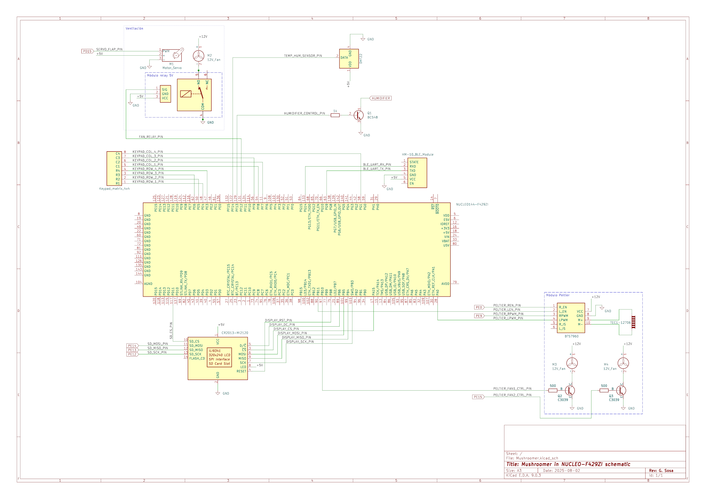
    
**Anexo B**: Esquemático completo del sistema *Mushroomer* mostrando todas las conexiones entre el microcontrolador y los módulos periféricos.
</div>

## Anexo C: Código de bloques de la aplicación móvil

&emsp;La aplicación móvil Android fue desarrollada utilizando MIT App Inventor [^12], una plataforma de programación visual basada en bloques. El siguiente diagrama muestra la lógica de programación completa de la aplicación, incluyendo la gestión de la conexión Bluetooth, el envío de comandos al sistema embebido y el procesamiento de las respuestas recibidas.

<div align="center">
    
    
**Anexo C**: Código de bloques de la aplicación móvil desarrollada en MIT App Inventor, mostrando la lógica completa de comunicación Bluetooth y control del sistema.
</div>

